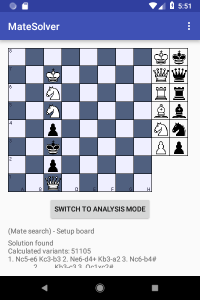
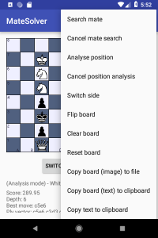
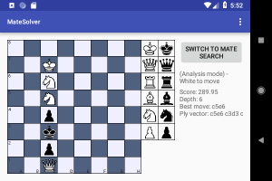
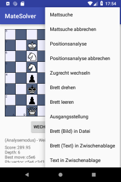

<h1>MateSolver</h1>
Deutsch weiter unten! 

  

A chess app to solve mate puzzles by brute force algorithm (checking all possible moves...)
and to analyse chess positions or chess games. There is an engine built in to evaluate scores
for a chess position. It is not intended to be your opponent. There are better apps and engines. 
Within the app you can save pictures of the board, copy move list to clipboard and copy board as text
to clipboard to document chess matches or chess problems with other apps of your device. 
You can build it with AndroidStudio or find the APK in the app folder. 
 
 
<h1>MateSolver</h1>

  

Eine Schach-App zum Lösen von Schachproblemen durch Bruteforce (Prüfen aller möglichen Züge...)
und zum Analysieren von Schachpositionen oder Schachpartien. Es gibt zwar eine Engine innerhalb der App
zum Berechnen des Wertes einer Schachposition, aber sie ist nicht als Gegner für Sie gedacht. 
Innerhalb der App können Sie Bilder des aktuellen Bretts speichern, die Zugliste in die Zwischenablage
kopieren und das aktuelle Brett als Text in die Zwischenablage kopieren, um Partien oder Probleme mit
anderen Apps Ihres Gerätes zu dokumentieren. 
Sie können die App mit AndroidStudio übersetzen, oder aber die APK im app-Ordner finden. 

