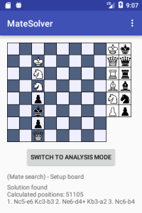
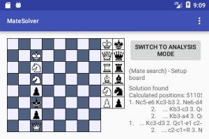

<h1>MateSolver</h1>
Deutsch weiter unten! 

 

A chess app to solve mate puzzles by brute force algorithm. 
Within the app you can save pictures of the board, copy move list to clipboard and copy board as text
to clipboard to document chess matches or chess problems with other apps of your device. 
The app also offers a mode to mateSearch positions where only legal moves are accepted. You can use this
mode for playing out a given position. 
You can build it with AndroidStudio or find the APK in the app folder. 
 
 
<h1>MateSolver</h1>

 

Eine Schach-App zum L&ouml;sen von Schachproblemen durch Bruteforce. 
Innerhalb der App können Sie Bilder des aktuellen Bretts speichern, die Zugliste in die Zwischenablage
kopieren und das aktuelle Brett als Text in die Zwischenablage kopieren, um Partien oder Probleme mit
anderen Apps Ihres Gerätes zu dokumentieren. 
Die App bietet Ihnen auch einen Analysemodus, in dem Sie eine Position ausspielen können, wobei nur legale
Züge erlaubt sind. Nutzen Sie diesen Modus, um eine gegebene Position durchzuspielen. 
Sie k&ouml;nnen die App mit AndroidStudio &uuml;bersetzen, oder aber die APK im app-Ordner finden. 

